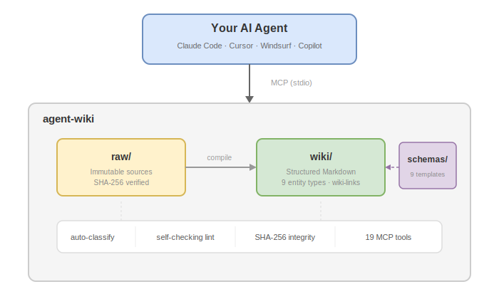

# agent-wiki

**The knowledge base that makes AI agents smarter over time.**

Instead of retrieving raw fragments every query (RAG), your agent compiles, refines, and interlinks knowledge — like a team wiki that writes itself.

Works with Claude Code, Cursor, Windsurf, and any MCP client. Also installable as a native skill for Claude Code. No LLM built in — your agent IS the intelligence.

[](https://www.npmjs.com/package/@agent-wiki/mcp-server)
[](https://github.com/xinhuagu/agent-wiki/actions/workflows/ci.yml)
[](https://nodejs.org)
[](https://modelcontextprotocol.io)
[](LICENSE)

## Quick Start

### Option A: MCP Server (Cursor, Windsurf, Claude Desktop, any MCP client)

Add to your MCP client config:

```json
{
  "mcpServers": {
    "agent-wiki": {
      "command": "npx",
      "args": ["-y", "@agent-wiki/mcp-server", "serve", "--wiki-path", "/path/to/knowledge"]
    }
  }
}
```

### Option B: Native Skill (Claude Code)

```bash
npm install -g @agent-wiki/mcp-server

# Install as Claude Code plugin
agent-wiki install claude-code
```

### Option C: CLI only

```bash
npx @agent-wiki/mcp-server call wiki_search '{"query": "deployment"}'
```

That's it. Your agent now has a persistent, structured knowledge base.

## Why Not RAG?

| | RAG | agent-wiki |
|---|---|---|
| **Approach** | Retrieve fragments at query time | Build and maintain compiled knowledge |
| **Memory** | Stateless — forgets after each query | Persistent — knowledge accumulates |
| **Quality** | Raw chunks, often noisy | Curated, structured, interlinked |
| **Cost** | Embedding + retrieval every query | One-time compilation, free reads |
| **Contradictions** | Invisible — buried in source docs | Flagged automatically by lint |
| **Source tracking** | Lost after retrieval | Full provenance chain (raw -> wiki) |

## Features

| Feature | Description |
|---------|-------------|
| **Batch Mode** | Generic `batch` tool + semantic pipelines — collapse multi-step workflows into single requests |
| **Knowledge Pipelines** | `knowledge_ingest_batch` + `knowledge_digest_write` — end-to-end ingest/digest/write-back loop |
| **Structured Extraction** | PDF (per-page), DOCX, XLSX (per-sheet), PPTX (per-slide) — segments with source provenance |
| **Immutable Sources** | SHA-256 verified `raw/` layer — write-once, tamper-proof, full provenance |
| **Knowledge Compilation** | Agent builds structured wiki pages from raw sources — not retrieve-and-forget |
| **BM25 Search** | Field-weighted scoring, synonym expansion, fuzzy matching, CJK tokenization — zero LLM | 
| **Hybrid Search** | Optional BM25+vector re-ranking via `@xenova/transformers` — enable with one config line, no external API |
| **Auto-Classification** | Zero-LLM heuristic assigns entity types and tags across 10 categories |
| **Multi-Level Indexes** | Auto-generated `index.md` at every directory level — nested topic hierarchies with sub-topic navigation |
| **Self-Checking Lint** | Catches contradictions, broken links, orphan pages, stale content |
| **Atlassian Import** | One-command Confluence pages and Jira issues with full hierarchy |
| **File Versioning** | Auto-version same-name files, query latest, list all versions |
| **COBOL Code Analysis** | AST parser with variable tracing, call graph generation, and auto wiki pages |
| **Skill Install** | One-command install as native skill for Claude Code and compatible clients |
| **Git-Native** | Plain Markdown — diffable, blameable, revertable |

## Architecture

Three immutability layers, inspired by how compilers work:

| Layer | Mutability | Role |
|-------|-----------|------|
| **raw/** | Immutable | Source documents — write-once, SHA-256 verified |
| **wiki/** | Mutable | Compiled knowledge — structured pages that improve over time |
| **schemas/** | Reference | Entity templates — consistent structure across knowledge types |

<p align="center">
  
</p>

## Design Principles

1. **Raw is immutable** — Source documents are write-once, SHA-256 verified. Ground truth never changes.
2. **Wiki is mutable** — Compiled knowledge improves with every interaction.
3. **No LLM dependency** — Zero API keys, zero cost per operation. Your agent IS the intelligence.
4. **Self-checking** — Lint catches structural issues and flags potential contradictions.
5. **Knowledge compounds** — Every write enriches the whole wiki. Synthesis creates higher-order understanding.
6. **Provenance matters** — Every wiki claim traces back to raw sources.
7. **Git-native** — Plain Markdown. Every change is diffable, blameable, and revertable.

## Integration

| Method | Best For | Setup |
|--------|----------|-------|
| **MCP Server** | Cursor, Windsurf, Claude Desktop, any MCP client | Add to `.mcp.json` |
| **Native Skill** | Claude Code (native plugin) | `agent-wiki install claude-code` |
| **CLI** | Any agent with shell access | `agent-wiki call <tool> '{json}'` |

## Hybrid Search Setup

Upgrade from keyword-only to semantic search with two steps:

**1.** Add to `.agent-wiki.yaml`:

```yaml
search:
  hybrid: true
```

**2.** Run `wiki_rebuild` once to embed all pages:

```bash
agent-wiki call wiki_rebuild
```

The first run downloads the `Xenova/all-MiniLM-L6-v2` model (~90 MB) from HuggingFace Hub and caches it locally. After that, every `wiki_write` automatically keeps the vector index up to date.

Hybrid mode blends BM25 + cosine similarity scores. If embedding fails for any reason, search falls back to pure BM25 — queries never fail.

See [Search configuration](docs/tools.md#hybrid-bm25vector-search) for weight tuning.

## Documentation

- [MCP Tools (18) & Entity Types](docs/tools.md)
- [Configuration, CLI & Security](docs/configuration.md)
- [Request Optimization — Batch Digest, Pagination, Context Limits](docs/request-optimization.md)

## Acknowledgment

Inspired by Andrej Karpathy's [LLM Wiki](https://gist.github.com/karpathy/442a6bf555914893e9891c11519de94f) concept — the idea that AI agents should compile and maintain knowledge, not just retrieve raw fragments. This project is an independent, full implementation of that vision.

## License

MIT
