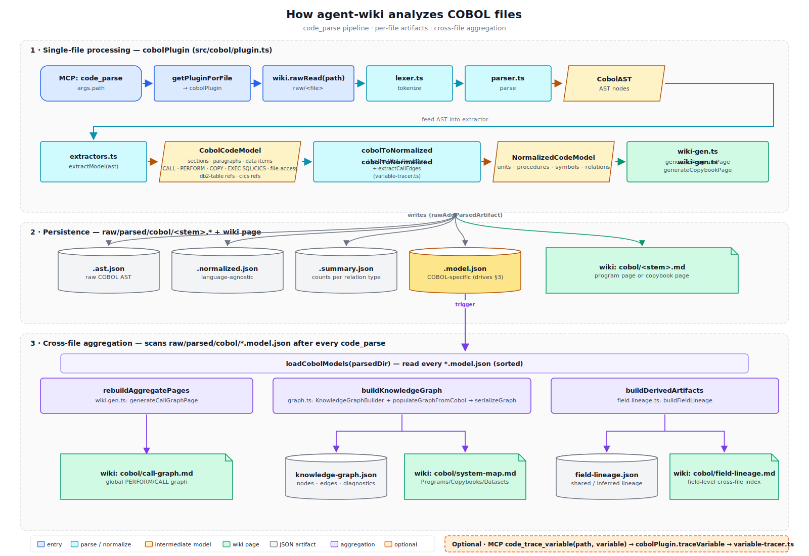

# Code Analysis Plugins

agent-wiki analyzes source code through a **plugin system**. Each language plugin parses its own source files, but every plugin emits the same shared `NormalizedCodeModel` that the wiki, query, and graph layers consume. The COBOL plugin is the first reference implementation; new languages are added by implementing the `CodeAnalysisPlugin` interface and registering it at server startup.

This page walks through how a single source file becomes wiki pages, JSON artifacts, and a cross-file knowledge graph — using the COBOL plugin as the worked example.

## Pipeline overview



The pipeline has three stages:

1. **Single-file processing** — parse one source file end-to-end
2. **Persistence** — write parsed artifacts and the per-file wiki page
3. **Cross-file aggregation** — rescan all parsed models and rebuild aggregate views

Stages 2 and 3 are the same shape for every plugin. Stage 1 is plugin-specific (lexer, parser, language extractors).

## Stage 1 · Single-file processing

Triggered by the MCP tool `code_parse({ path })` (see `src/server.ts` and `src/cobol/plugin.ts`).

| Step | Module | Responsibility |
|------|--------|----------------|
| `code_parse` | `server.ts` | MCP entry — receives the raw path |
| `getPluginForFile` | `code-analysis.ts` | Dispatches by file extension to the matching plugin |
| `wiki.rawRead(path)` | `wiki.ts` | Reads the immutable source from `raw/` |
| `plugin.parse(source, filename)` | plugin | Lex + parse into a language-specific AST |
| `plugin.normalize(ast)` | plugin | Map the AST into the shared `NormalizedCodeModel`, including dataflow and call-parameter edges |
| `plugin.generateWikiPages(model, path, ast)` | plugin | Render Markdown pages with full-fidelity language detail |

In the COBOL plugin (`src/cobol/`):

- `lexer.ts` produces tokens
- `parser.ts` builds `CobolAST`
- `extractors.ts: extractModel` derives `CobolCodeModel` (sections, paragraphs, data items, `CALL`, `PERFORM`, `COPY`, `EXEC SQL`, `EXEC CICS`, file-access)
- `variable-tracer.ts` adds `dataflow` and `call-param` edges to the normalized model
- `wiki-gen.ts` renders the program / copybook page

## Stage 2 · Persistence

For every parsed source file, agent-wiki writes a fixed set of artifacts under `raw/parsed/<lang>/<stem>.*` and one wiki page:

| Artifact | Source | Purpose |
|----------|--------|---------|
| `<stem>.ast.json` | `plugin.parse` output | Language-specific AST (debug / replay) |
| `<stem>.normalized.json` | `plugin.normalize` output | Language-agnostic model — input to `code_query` |
| `<stem>.summary.json` | `summarizeModel` | Counts per relation type and diagnostic level |
| `<stem>.model.json` | `plugin.extractLanguageModel` (optional) | Richer language-specific model — drives Stage 3 |
| `wiki/<lang>/<stem>.md` | `plugin.generateWikiPages` | Human-readable per-file page |

Only `<stem>.model.json` triggers cross-file aggregation. The other artifacts are end-products consumed by `code_query` and by humans.

## Stage 3 · Cross-file aggregation

After every successful `code_parse`, the plugin scans `raw/parsed/<lang>/*.model.json` and rebuilds three independent views (each is optional on the plugin interface):

| Hook | Output | Purpose |
|------|--------|---------|
| `rebuildAggregatePages(parsedDir)` | `wiki/<lang>/call-graph.md` | Global call/perform graph across all parsed files |
| `buildKnowledgeGraph(parsedDir)` | `raw/parsed/<lang>/knowledge-graph.json` + `wiki/<lang>/system-map.md` | Cross-file knowledge graph (Programs, Copybooks, Datasets, Jobs, Steps) with edge confidence; consumed by `code_query` `impact` |
| `buildDerivedArtifacts(parsedDir)` | `raw/parsed/<lang>/field-lineage.json` + `wiki/<lang>/field-lineage.md` | Field-level lineage covering three families: (1) deterministic + inferred cross-copybook field reuse, (2) cross-program field flow at static `CALL ... USING` boundaries, (3) cross-program data flow via shared DB2 tables. The aggregated artifact carries optional `callBoundLineage` and `db2Lineage` sections; the wiki page renders each family in its own block, with empty families omitted. Loaded `.model.json` files are normalized via `migrateLoadedModel` so artifacts produced by older releases keep working without re-parsing. |

Aggregation runs synchronously inside `code_parse` by default. The `batch` MCP tool defers it (`skipGraphRebuild`) so that bulk ingest only rebuilds aggregates once at the end.

## Optional · Variable tracing

`code_query({ query_type: "trace_variable", path, variable })` bypasses the persistence pipeline: it re-parses the file in-memory and asks `plugin.traceVariable(ast, variable)` directly. The COBOL implementation lives in `src/cobol/variable-tracer.ts`.

## The `CodeAnalysisPlugin` interface

Every plugin implements this contract from `src/code-analysis.ts`:

```ts
interface CodeAnalysisPlugin {
  id: string;                  // e.g. "cobol", "java"
  languages: string[];         // e.g. ["COBOL"]
  extensions: string[];        // e.g. [".cbl", ".cob", ".cpy"]

  // Required
  parse(source: string, filename: string): unknown;
  normalize(ast: unknown): NormalizedCodeModel;
  generateWikiPages(
    model: NormalizedCodeModel,
    sourceFile: string,
    ast?: unknown,
  ): Array<{ path: string; content: string }>;

  // Optional — recommended for full functionality
  traceVariable?(ast, variable): VariableReference[];
  extractLanguageModel?(ast): unknown;        // richer than NormalizedCodeModel
  rebuildAggregatePages?(parsedDir): Array<{ path; content }>;
  buildKnowledgeGraph?(parsedDir): { serialized; wikiPages } | null;
  buildDerivedArtifacts?(parsedDir): {
    artifacts; wikiPages; staleArtifacts?; staleWikiPages?;
  } | null;
}
```

### `NormalizedCodeModel`

The shared shape every plugin emits:

| Field | Description |
|-------|-------------|
| `units` | Programs, classes, modules, copybooks |
| `procedures` | Functions, methods, paragraphs, sections |
| `symbols` | Variables, fields, constants, parameters |
| `relations` | Calls, performs, includes, imports, dataflow, call-param, db2-table, cics-program/transaction/map/file, file-access |
| `diagnostics` | Warnings and errors from parsing |

The model intentionally drops language-specific structure (COBOL `PIC` clauses, Java annotations, Python decorators). Plugins that need that detail emit it through `extractLanguageModel` into `<stem>.model.json` and use it inside their own `generateWikiPages`.

## Adding a new language plugin

1. Create `src/<lang>/plugin.ts` that exports a `CodeAnalysisPlugin` matching the interface above.
2. Implement at minimum `parse`, `normalize`, and `generateWikiPages`. Add `extractLanguageModel` and the aggregate hooks as the language warrants.
3. Register the plugin at server startup in `src/server.ts`:

   ```ts
   import { registerPlugin } from "./code-analysis.js";
   import { javaPlugin } from "./java/plugin.js";

   registerPlugin(javaPlugin);
   ```

4. The MCP surface (`code_parse`, `code_query`) picks up the new extensions automatically — no changes required in `server.ts`'s tool dispatch beyond plugin registration.

## Reference example — COBOL plugin layout

```
src/cobol/
├── plugin.ts                implements CodeAnalysisPlugin, wires the rest together
├── lexer.ts                 tokenizer (fixed-format with alphanumeric sequence area + free-format)
├── parser.ts                AST builder → CobolAST
├── extractors.ts            CobolAST → CobolCodeModel (calls + usingArgs, linkageItems, db2/cics/file refs)
├── variable-tracer.ts       dataflow + call-param edges, traceVariable, extractUsingArgs helper
├── graph.ts                 KnowledgeGraphBuilder, populateGraphFromCobol, serializeGraph
├── field-lineage.ts         buildFieldLineage (cross-copybook field index) + combineFieldLineage
├── call-boundary-lineage.ts buildCallBoundLineage (caller USING ↔ callee LINKAGE positional matching)
├── db2-table-lineage.ts     buildDb2TableLineage (writer/reader pairs across shared DB2 tables)
├── wiki-gen.ts              program / copybook / call-graph page renderers
└── types.ts                 CobolAST, DataItemNode, etc.
```

Outputs after parsing one program:

```
raw/parsed/cobol/PAYROLL.ast.json
raw/parsed/cobol/PAYROLL.normalized.json
raw/parsed/cobol/PAYROLL.summary.json
raw/parsed/cobol/PAYROLL.model.json
wiki/cobol/PAYROLL.md
```

After any parse, the aggregates are refreshed:

```
raw/parsed/cobol/knowledge-graph.json
raw/parsed/cobol/field-lineage.json
wiki/cobol/call-graph.md
wiki/cobol/system-map.md
wiki/cobol/field-lineage.md
```

## See also

- [`tools.md`](tools.md) — MCP tool surface (`code_parse`, `code_query`)
- [`legacy-code-knowledge-compiler-prd.md`](legacy-code-knowledge-compiler-prd.md) — design context and the JCL plugin decision
